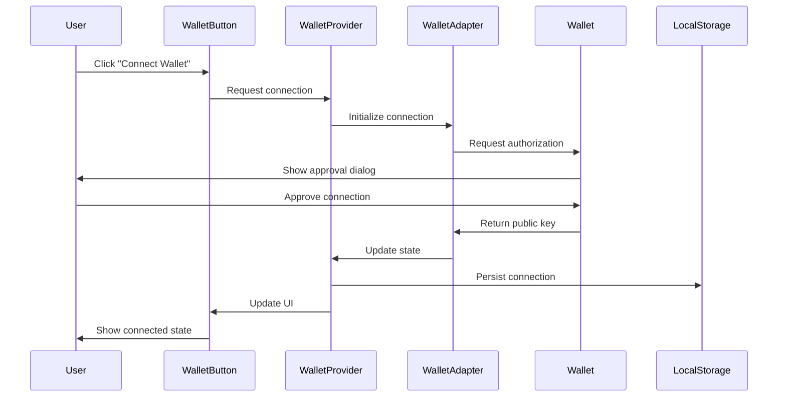

# Design Document: Solana Wallet Connect

## Overview

This design document specifies the technical implementation for integrating Solana wallet connection functionality into the LearnLedger landing page application. The feature enables users to connect their Solana wallets (Phantom, Solflare, and other standard wallets) to authenticate and interact with the blockchain.

The implementation leverages the official Solana Wallet Adapter libraries, which provide a standardized interface for wallet connections across different wallet providers. The design follows React best practices with context-based state management and integrates seamlessly with the existing LearnLedger design system.

### Key Design Goals

- Provide a seamless wallet connection experience across desktop and mobile devices
- Maintain connection state persistence across page refreshes
- Integrate with existing UI components and design system
- Support multiple wallet providers through a unified interface
- Handle errors gracefully with clear user feedback
- Ensure proper cleanup of resources and event listeners

## Architecture

### Component Hierarchy

```
App
├── WalletContextProvider (new)
│   └── Navbar
│       └── WalletButton (new)
└── Other Components
```

### Architectural Layers

1. **Provider Layer**: `WalletContextProvider` wraps the application and manages wallet state
2. **UI Layer**: `WalletButton` component provides user interaction interface
3. **Adapter Layer**: Solana Wallet Adapter libraries handle wallet-specific communication
4. **Storage Layer**: Browser localStorage for connection persistence

### Data Flow



### Network Configuration

The application will connect to Solana's devnet for development and testing. The network configuration will be centralized in a configuration file to enable easy switching between networks (devnet, testnet, mainnet-beta) for different environments.

## Components and Interfaces

### WalletContextProvider

A React context provider that wraps the application and manages wallet connection state.

**Location**: `src/app/providers/WalletProvider.tsx`

**Responsibilities**:
- Initialize wallet adapters for supported wallets
- Manage wallet connection lifecycle
- Provide wallet state to child components
- Handle connection persistence via localStorage
- Configure Solana network endpoint

**Props**:
```typescript
interface WalletProviderProps {
  children: React.ReactNode;
}
```

**Implementation Details**:
- Uses `@solana/wallet-adapter-react` for React integration
- Configures `ConnectionProvider` with Solana RPC endpoint
- Configures `WalletProvider` with wallet adapters array
- Wraps children with `WalletModalProvider` for UI
- Enables auto-connect for session persistence

**Wallet Adapters to Include**:
- `PhantomWalletAdapter`
- `SolflareWalletAdapter`
- Additional standard wallet adapters as needed

### WalletButton Component

A custom button component that provides wallet connection interface.

**Location**: `src/app/components/WalletButton.tsx`

**Responsibilities**:
- Display connection status (connected/disconnected)
- Trigger wallet connection modal
- Show truncated public key when connected
- Provide disconnect functionality
- Adapt to mobile and desktop layouts

**Props**:
```typescript
interface WalletButtonProps {
  className?: string;
  variant?: 'default' | 'mobile';
}
```

**State Display Logic**:
- **Disconnected**: Show "Connect Wallet" text with wallet icon
- **Connected**: Show truncated public key (first 4 + last 4 characters)
- **Connecting**: Show loading state
- **Error**: Show error indicator

**Styling**:
- Desktop: Matches existing navbar button style with #14F195 background
- Mobile: Full-width button in mobile menu
- Uses existing button component from UI library as base
- Includes wallet icon from lucide-react

### Navbar Integration

**Location**: `src/app/components/Navbar.tsx` (existing, to be modified)

**Changes Required**:
- Remove mock wallet connection state
- Replace existing wallet button with new `WalletButton` component
- Maintain existing layout and responsive behavior
- Ensure WalletButton appears in both desktop and mobile views

### Configuration Module

**Location**: `src/app/config/solana.ts`

**Purpose**: Centralize Solana network configuration

**Exports**:
```typescript
export const SOLANA_NETWORK = WalletAdapterNetwork.Devnet;
export const SOLANA_RPC_ENDPOINT = clusterApiUrl(SOLANA_NETWORK);
```

This allows easy network switching for different environments.

## Data Models

### Wallet State

The wallet state is managed by the Solana Wallet Adapter and includes:

```typescript
interface WalletState {
  // From @solana/wallet-adapter-react
  publicKey: PublicKey | null;
  connected: boolean;
  connecting: boolean;
  disconnecting: boolean;
  wallet: Wallet | null;
  
  // Methods
  connect: () => Promise<void>;
  disconnect: () => Promise<void>;
  select: (walletName: WalletName) => void;
}
```

### Connection Persistence

Connection state is persisted in browser localStorage by the wallet adapter library automatically. The key used is `walletName` which stores the last connected wallet identifier.

**Storage Schema**:
```typescript
// Managed automatically by @solana/wallet-adapter-react
localStorage.setItem('walletName', string); // Wallet adapter name
```

### Public Key Display Format

When displaying the connected wallet's public key:

**Format**: `{first4}...{last4}`

**Example**: `7xKX...9B4z`

**Implementation**:
```typescript
function truncatePublicKey(publicKey: PublicKey): string {
  const address = publicKey.toBase58();
  return `${address.slice(0, 4)}...${address.slice(-4)}`;
}
```

## Correctness Properties

*A property is a characteristic or behavior that should hold true across all valid executions of a system—essentially, a formal statement about what the system should do. Properties serve as the bridge between human-readable specifications and machine-verifiable correctness guarantees.*

### Property 1: Public Key Truncation Format

*For any* valid Solana public key, the truncation function should return a string in the format `{first4}...{last4}` where first4 and last4 are exactly 4 characters each from the base58-encoded address.

**Validates: Requirements 2.3**

### Property 2: UI State Consistency

*For any* wallet connection state (connected or disconnected), the WalletButton UI should always display content that accurately reflects the current state: "Connect Wallet" when disconnected, or the truncated public key when connected.

**Validates: Requirements 2.1, 2.2, 3.4**

### Property 3: Connection State Transitions

*For any* wallet connection event (successful authorization, disconnection, valid restoration, or invalid restoration), the Wallet_Provider state should transition correctly: to Connected_State for successful connections and valid restorations, and to Disconnected_State for disconnections and invalid restorations.

**Validates: Requirements 1.4, 3.3, 5.3, 5.4**

### Property 4: Connection Persistence Round Trip

*For any* successful wallet connection, storing the connection state to localStorage and then restoring it on application reload should result in the same connected state with the same public key.

**Validates: Requirements 5.1, 5.2**

### Property 5: Error State Consistency

*For any* connection error (authorization denied, timeout, or failure), the Wallet_Provider should remain in or transition to Disconnected_State and display an appropriate error message to the user.

**Validates: Requirements 1.5, 6.3, 6.4**

### Property 6: Network Configuration Consistency

*For any* blockchain interaction initiated through the Wallet_Adapter, the interaction should use the configured Wallet_Adapter_Network (devnet, testnet, or mainnet-beta) consistently throughout the session.

**Validates: Requirements 4.2, 4.3**

### Property 7: Wallet Selection Triggers Authorization

*For any* wallet selected from the available wallet options, the Wallet_Adapter should request connection authorization from that specific wallet provider.

**Validates: Requirements 1.3**

### Property 8: Click Behavior Based on State

*For any* click event on the WalletButton, the resulting action should depend on the current state: display wallet options when disconnected, or display disconnect option when connected.

**Validates: Requirements 1.2, 3.1**

### Property 9: Disconnect Terminates Connection

*For any* disconnect action initiated by the user, the Wallet_Provider should terminate the active wallet connection and clear the connection state.

**Validates: Requirements 3.2**

### Property 10: Mobile Wallet Deep Linking

*For any* mobile wallet selection on a mobile device, the Wallet_Adapter should initiate connection via deep link to open the corresponding wallet application.

**Validates: Requirements 7.1, 7.2, 7.3**

### Property 11: Resource Cleanup on Lifecycle Events

*For any* lifecycle event (application unmount, wallet disconnect, or wallet switch), the Wallet_Provider should properly cleanup all event listeners and clear cached wallet data before the event completes.

**Validates: Requirements 10.1, 10.2, 10.3**

## Error Handling

### Error Categories

The wallet connection feature must handle several categories of errors:

1. **Wallet Not Detected**
   - Occurs when no Solana wallet extension is installed
   - Display: User-friendly message with links to install Phantom or Solflare
   - Action: Remain in Disconnected_State

2. **Connection Timeout**
   - Occurs when wallet authorization request exceeds timeout threshold (typically 60 seconds)
   - Display: "Connection timed out. Please try again."
   - Action: Remain in Disconnected_State, allow retry

3. **Authorization Denied**
   - Occurs when user rejects the connection request in their wallet
   - Display: "Connection request was declined."
   - Action: Remain in Disconnected_State, allow retry

4. **Network Errors**
   - Occurs when RPC endpoint is unreachable or returns errors
   - Display: "Network error. Please check your connection."
   - Action: Remain in Disconnected_State, allow retry

5. **Invalid Stored Connection**
   - Occurs when attempting to restore a connection from localStorage that is no longer valid
   - Display: Silent failure (no error message)
   - Action: Transition to Disconnected_State, clear localStorage

### Error Handling Implementation

**Error Display Component**:
- Use toast notifications (via sonner library already in dependencies)
- Position: Top-right corner
- Duration: 5 seconds for errors, 3 seconds for success messages
- Dismissible: Yes

**Error Recovery**:
- All errors should allow the user to retry the connection
- Clear any error state when user initiates a new connection attempt
- Log errors to console for debugging (in development mode)

**Error Boundaries**:
- Wrap WalletContextProvider in an error boundary to catch React errors
- Prevent wallet connection errors from crashing the entire application
- Fallback UI: Show "Wallet connection unavailable" message

### Error State Management

```typescript
interface WalletError {
  type: 'not_detected' | 'timeout' | 'denied' | 'network' | 'invalid_stored';
  message: string;
  timestamp: number;
}
```

The error state should be:
- Stored in the wallet context
- Cleared on successful connection
- Cleared when user initiates new connection attempt
- Not persisted to localStorage

## Testing Strategy

### Dual Testing Approach

This feature requires both unit tests and property-based tests to ensure comprehensive coverage:

- **Unit tests**: Verify specific examples, edge cases, and error conditions
- **Property tests**: Verify universal properties across all inputs

### Unit Testing

**Framework**: Vitest (already configured in the project)

**Test Files**:
- `src/app/providers/WalletProvider.test.tsx`
- `src/app/components/WalletButton.test.tsx`
- `src/app/config/solana.test.ts`

**Unit Test Focus Areas**:

1. **Component Rendering**:
   - WalletButton renders correctly in disconnected state
   - WalletButton renders correctly in connected state
   - WalletButton renders correctly in mobile view
   - WalletButton renders correctly in desktop view

2. **Specific Examples**:
   - Truncation of known public key produces expected output
   - Network configuration initializes with devnet
   - Required dependencies are present in package.json

3. **Edge Cases**:
   - No wallet extension detected
   - Connection timeout
   - Invalid localStorage data
   - Rapid connect/disconnect cycles

4. **Integration Points**:
   - WalletProvider integrates with Navbar
   - WalletButton triggers wallet modal
   - Toast notifications display on errors

### Property-Based Testing

**Framework**: fast-check (to be added as dev dependency)

**Configuration**: Minimum 100 iterations per property test

**Test File**: `src/app/providers/WalletProvider.properties.test.tsx`

**Property Test Implementation**:

Each property test must:
1. Reference its design document property in a comment
2. Run at least 100 iterations
3. Use appropriate generators for test data
4. Verify the property holds for all generated inputs

**Tag Format**:
```typescript
// Feature: solana-wallet-connect, Property 1: Public Key Truncation Format
```

**Generators Needed**:
- `arbitraryPublicKey()`: Generate valid Solana public keys
- `arbitraryWalletState()`: Generate wallet connection states
- `arbitraryNetworkConfig()`: Generate network configurations
- `arbitraryConnectionEvent()`: Generate connection lifecycle events

**Property Tests to Implement**:

1. **Property 1**: Public Key Truncation Format
   - Generate random valid public keys
   - Verify truncation always produces `{4chars}...{4chars}` format

2. **Property 2**: UI State Consistency
   - Generate random wallet states
   - Verify UI display matches state

3. **Property 3**: Connection State Transitions
   - Generate random connection events
   - Verify state transitions are correct

4. **Property 4**: Connection Persistence Round Trip
   - Generate random connection states
   - Verify localStorage round trip preserves state

5. **Property 5**: Error State Consistency
   - Generate random error conditions
   - Verify state remains disconnected and error is displayed

6. **Property 6**: Network Configuration Consistency
   - Generate random network configs
   - Verify all interactions use configured network

7. **Property 7**: Wallet Selection Triggers Authorization
   - Generate random wallet selections
   - Verify authorization is requested

8. **Property 8**: Click Behavior Based on State
   - Generate random states and click events
   - Verify correct action is triggered

9. **Property 9**: Disconnect Terminates Connection
   - Generate random connected states
   - Verify disconnect clears connection

10. **Property 10**: Mobile Wallet Deep Linking
    - Generate random mobile wallet selections
    - Verify deep link is initiated

11. **Property 11**: Resource Cleanup on Lifecycle Events
    - Generate random lifecycle events
    - Verify cleanup occurs

### Test Coverage Goals

- **Line Coverage**: Minimum 80%
- **Branch Coverage**: Minimum 75%
- **Function Coverage**: Minimum 85%

### Testing Dependencies to Add

```json
{
  "devDependencies": {
    "@testing-library/react": "^14.0.0",
    "@testing-library/jest-dom": "^6.1.0",
    "@testing-library/user-event": "^14.5.0",
    "fast-check": "^3.15.0",
    "vitest": "^1.0.0",
    "@vitest/ui": "^1.0.0"
  }
}
```

### Mock Requirements

**Wallet Adapter Mocks**:
- Mock wallet extensions (Phantom, Solflare)
- Mock wallet authorization flows
- Mock localStorage
- Mock RPC endpoints

**Test Utilities**:
- Helper to create mock wallet contexts
- Helper to simulate wallet connection flows
- Helper to generate test public keys
- Helper to simulate mobile environment

